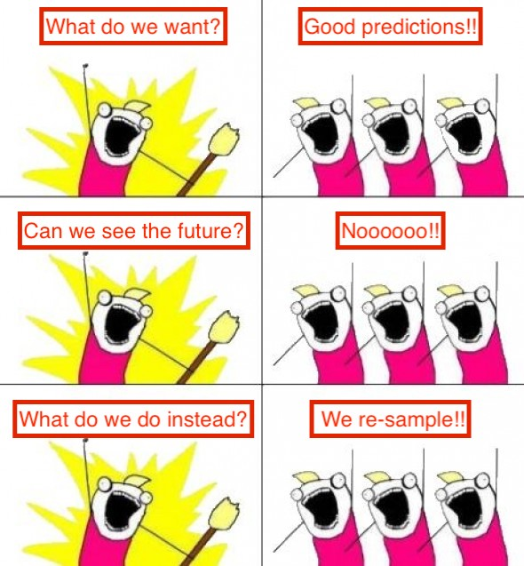
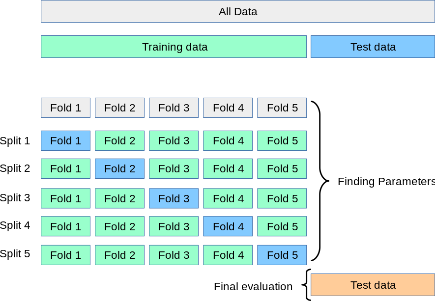
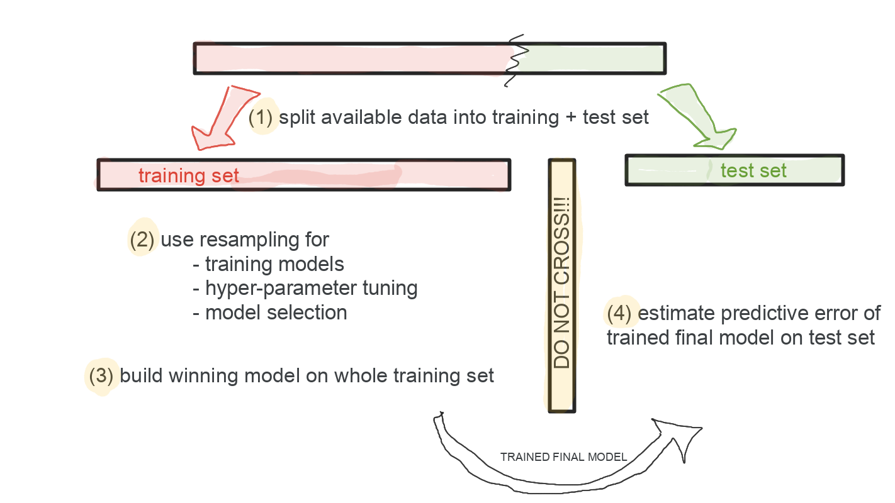

```{r setup, include=FALSE}
knitr::opts_chunk$set(echo = FALSE)
```

## The big question

**You fit (_train_) a model to a data sample. How "good" is this solution? Can we estimate it?**

We know that computing the error on the same data used for fitting the model (i.e., the **training error**) is in general wrong, because we can make the error optimistically small (overfitting).

Instead of a fitting error, we need a **prediction error**


## What do we want?

{#id .class width=70% height=70%}


## Tasks we need data for

In practice we have only **one** data sample and we need to do three different tasks, which require different (actually, independent) data samples. These tasks are:

1. fit/train models to data ("calculation of the model's parameters")
2. if several candidate models are available, choose the most promising one ("model selection"); also choose appropriate values for hyper-parameter(s)
3. estimate the error of the selected model as honestly as possible ("error estimation")

## Predictive error estimation (3)

There is only one universal way: use a separate data sample (called a **test sample**).

There are two options:

1. Wait to have more data, and see how well the model does. Not ideal in many contexts.

2. The **holdout** method: reserve some data for this purpose, do not use it until your model is trained. Use the held-out data to test the model.


## Training and model selection (1+2)

For this we have at least two options.

1) Use a heuristic that combines the training errors obtained with
some measure of the complexity of the model; one finds methods such as AIC and BIC;
the former is typically used with GLMs; the latter is used with E-M for clustering, among others

There are many drawbacks:

- it is unclear how they behave for non-linear models,
- they do not provide with an estimation of the error (just an abstract quantity), and
- are only crude approximations

... so we won't pursue them further; however, they find their place in some cases


## Training and model selection (1+2) cont.

2) Use a resampling strategy: divide the data into parts for fitting the models (**training**)
and parts for making them predict (**validation**). The general form is called
**cross-validation**, of which **LOOCV** is a particular case.

The **average cross-validation error** is typically used for **model selection**.

When we have selected a model, we refit it on the full data available for **learning** (**training + validation**)
and use the final model to predict the **test** set and consequently estimate its generalization error.


## Resampling strategies

We will cover the following strategies, with increasing level of sophistication:

- train/val split
- Monte-Carlo cross-validation
- k-fold cross-validation
- LOOCV (leave-one-out cross-validation)
- Iterated k-fold cross-validation

## Train/Val split, Monte-Carlo cross-validation


## Train/Val split, Monte-Carlo cross-validation (cont.)

- Partition should be **randomized** (care should be taken with non iid data such as time-series!)

- Ideally **stratified**

- Typical default percentages train/val/test: 50/25/25
  however largely dependent on dataset dimension and learning algorithm
  
- **Method of choice** if lots of data are available

- Sensitive to split so in **Monte-Carlo cross-validation**, repeat process of split into training + validation several times and report average performance

## k-fold cross-validation



## k-fold cross-validation (cont.)

- $2 \leq k \leq n$, where $n$ is the size of training data

- When $k = n$, then this is called *leave-one-out cross-validation* or **loocv**

- Method of choice for tuning hyper-parameters and model selection, namely: keep model + hyperparameters that minimize cross-validation error (i.e. mean error over all folds)

- Ideally **stratified**, necessarily **randomized**

- Still sensitive to partition, so if computational resources permit it, iterate cross-validation, and minimize average cross-validation error, typical values are 10x10 cross-validation

- For loocv, iteration is obviously not needed

- Popular choices are **5 cv** or **10 cv**, **10x10 cv** and **loocv**


## Typical machine learning experimental protocol


1. Split data into two parts: **training** and **test** sets. 
_Reserve the test set and do not look at it until the end._

2. Use resampling technique of your choice on your training set for model selection.

3. Build final model by re-training on the whole training set using optimal hyper-parameters and modelling technique from step 2.

4. Estimate error of final model on **test set** reserved in step 1.


## Typical machine learning experimental protocol, visually

```{r, echo=FALSE, fig.align='center', out.width = "100%"}

```

